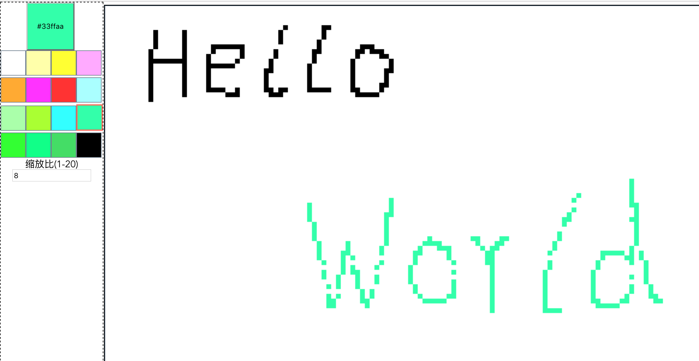

# paintboard

# 这是什么

* 这是一个可以`多人在线实时`在共享网络画板上进行像素绘制的小玩意
* 1.0版本的前后台大概花了1个晚上的时间完成，目前还在不断更新功能中
* 这个项目目的主要是业余消遣，顺便复习一下canvas的api


# todo&plan:

目前的开发计划，在[这里](todo.md)


# 项目结构:

目前的结构非常简单：

* 配置：
    * 配置都放在`./config`目录下
    * 这里面的配置有一部分是前后台`共享`的，比如画板的大小等设定
* 后台代码：
    * 主要由本目录的`./server.js`构成，由于目前版本功能还比较简单，所以未做进一步划分
    * 主要使用了`socket.io+express`开发
    * `./files`里主要是Exress的静态文件，这些文件是从`./front-end`前端工程中构建出来的。
* 前端代码：
    * 在`./front-end`目录内
    * 使用`webpack+Vue2.0`开发
    * 前端工程构建，请参考:[这里](front-end/README.md)


# 如何启动:
首先download代码到本地目录，解压缩，比如是`paint`目录

```
$ cd paint
$ npm install

$ cd front-end //进入前端工程目录
$ npm install
$ npm run build // unix系统可使用./run.sh

cd .. //回到server目录
node ./server.js // unix系统可使用 /run.sh

```
可以看到控制台打印出类似信息：

```
listening on *:3000
```

然后就可以打开浏览器`http://localhost:3000/index.html#/`查看效果了.

